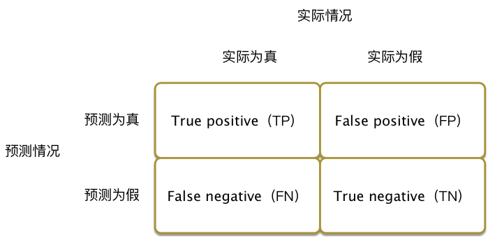
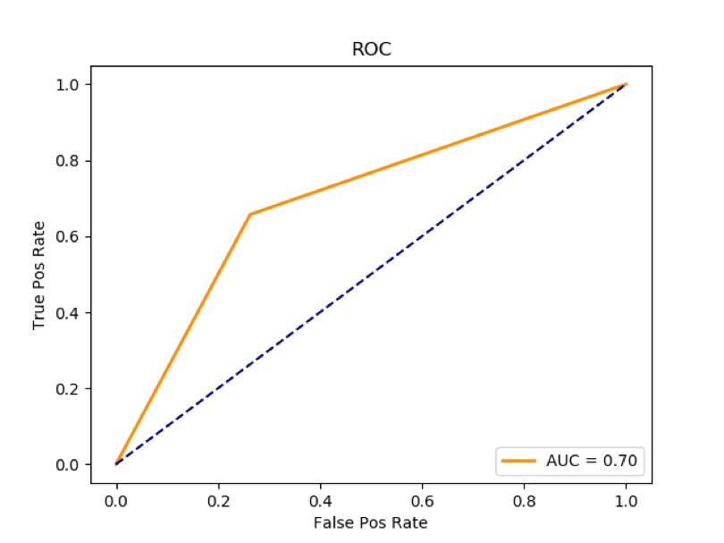

# 概述
在NLP中我们经常需要使用机器学习的分类器。如何衡量一个分类器的好坏呢？最常见的指标包括准确率与召回率,准确度与F1-Score以及ROC与AUC。
# 测试数据
我们以Scikit-Learn环境介绍常见的性能衡量指标。为了演示方便，我们创建测试数据，测试数据一共1000条记录，每条记录100个特征，内容随机生成。

	x, y = datasets.make_classification(n_samples=1000, n_features=100,
						n_redundant=0, random_state = 1)
	把数据集随机划分成训练集和测试集，其中测试集占40%。
	train_X, test_X, train_y, test_y = train_test_split(x,
                                                    y,
                                                    test_size=0.2,
                                                    random_state=66)

使用KNN算法进行训练和预测。

	knn = KNeighborsClassifier(n_neighbors=5)
	knn.fit(train_X, train_Y)
	pred_Y = knn.predict(test_X)
	
# 混淆矩阵
混淆矩阵，即Confusion Matrix，是将分类问题按照真实情况与判别情况两个维度进行归类的一个矩阵，在二分类问题中，可以用一个2乘以2的矩阵表示。如图1-1 所示，TP表示实际为真预测为真，TN表示实际为假预测为假，FN表示实际为真预测为假，通俗讲就是漏报了，FP表示实际为假预测为真，通俗讲就是误报了。

在Scikit-Learn中，使用metrics.confusion_matrix输出混淆矩阵。

	print "confusion_matrix:"
	print metrics.confusion_matrix(test_Y, pred_Y)
	
输出结果如下，其中漏报 36个，误报了25个。

	confusion_matrix:
	[[70 25]
	 [36 69]]
	 
# 准确率与召回率
机器学习中最基本指标是召回率(Recall Rate)和准确率(Precision Rate)，召回率也叫查全率，准确率也叫查准率。

	召回率=TP/(TP+FN)
	准确率=TP/(TP+FP)

用一个吃货都可以理解的例子来解释这两个枯燥的概念。一个池塘有10条鱼和20只小龙虾，渔夫撒网打鱼，结果捞上来8条鱼12只小龙虾，那么准确率为8/(8+12)=40%，召回率为8/10=80%。
在Scikit-Learn中，可以如下获得准确率和召回率。

	print "recall_score:"
	print metrics.recall_score(test_Y, pred_Y)
	print "precision_score:"
	print metrics.precision_score(test_Y, pred_Y)

输出结果如下，其中召回率为65.71%，准确率为73.40%。

	recall_score:
	0.657142857143
	precision_score:
	0.734042553191
	
# 准确度与F1-Score
准确度（Accuracy）是对检测结果一个均衡的评价，表现的是全体预测正确占全部样本的比例。F1-Score也是对准确率和召回率的一个均衡评价，国内外不少数据挖掘比赛都是重点关注F1-Score的值。在Scikit-Learn中，可以如下获得准确度和F1-Score。

	print "accuracy_score:"
	print metrics.accuracy_score(test_Y, pred_Y)
	print "f1_score:"
	print metrics.f1_score(test_Y, pred_Y)

输出结果如下，其中准确度为69.5%和F1-Score为69.34%。

	accuracy_score:
	0.695
	f1_score:
	0.693467336683

# ROC与AUC
ROC（Receiver Operating Characteristic Curve）受试者工作特征曲线，以真阳性率为纵坐标，假阳性率为横坐标绘制的曲线，是反映灵敏性和特效性连续变量的综合指标。一般认为ROC越光滑说明分类算法过拟合的概率越低，越接近左上角说明分类性能越好。AUC（Area Under the Receiver Operating Characteristic Curve）就是量化衡量ROC分类性能的指标，如图1-2 所示，物理含义是ROC曲线的面积，AUC越大越好。

绘制ROC曲线的方法如下：

	f_pos, t_pos, thresh = metrics.roc_curve(test_Y, pred_Y)
	auc_area = metrics.auc(f_pos, t_pos)
	plt.plot(f_pos, t_pos, 'darkorange', lw=2, label='AUC = %.2f' % auc_area)
	plt.legend(loc='lower right')
	plt.plot([0, 1], [0, 1], color='navy', linestyle='--')
	plt.title('ROC')
	plt.ylabel('True Pos Rate')
	plt.xlabel('False Pos Rate')
	plt.show()
	
在Scikit-Learn中，可以如下获得AUC值。

	print "AUC:"
	print metrics.roc_auc_score(test_Y, pred_Y)

计算获得的AUC值为0.70。

	AUC:
	0.696992481203
