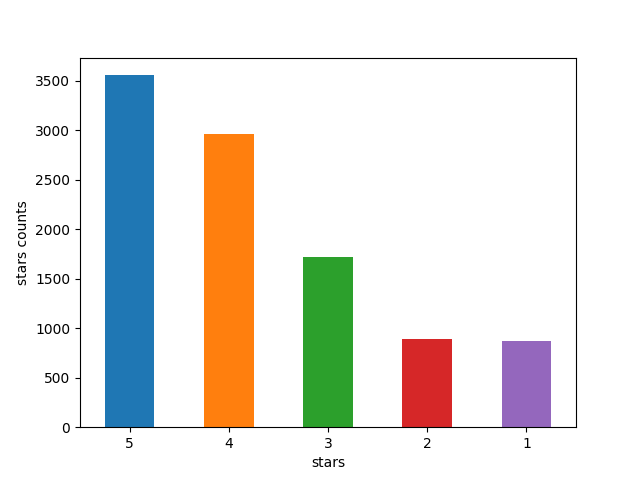
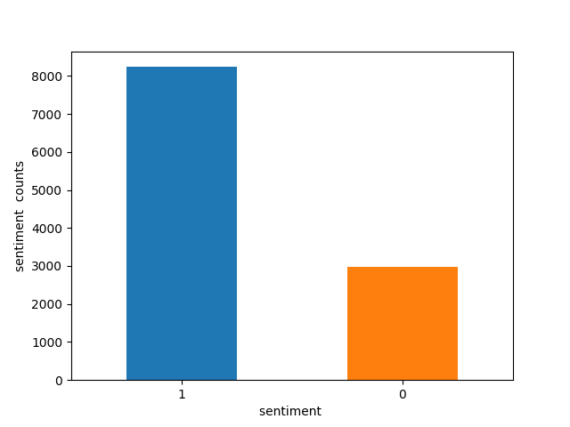
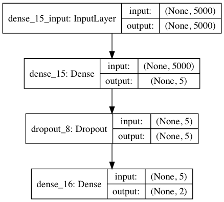
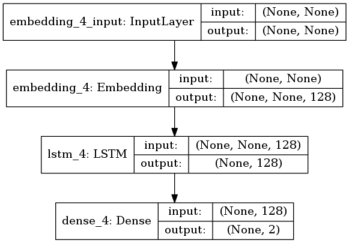

# Yelp简介
Yelp是美国著名商户点评网站，创立于2004年，囊括各地餐馆、购物中心、酒店、旅游等领域的商户，用户可以在Yelp网站中给商户打分，提交评论，交流购物体验等。在Yelp中搜索一个餐厅或者旅馆，能看到它的简要介绍以及网友的点论，点评者还会给出多少星级的评价，通常点评者都是亲身体验过该商户服务的消费者，评论大多形象细致。
# Yelp Reviews
Yelp Reviews是Yelp为了学习目的而发布的一个开源数据集。它包含了由数百万用户评论，商业属性和来自多个大都市地区的超过20万张照片。这是一个常用的全球NLP挑战数据集，包含5,200,000条评论，174,000条商业属性。 数据集下载地址为：

> https://www.yelp.com/dataset/download

Yelp Reviews格式分为JSON和SQL两种，以JSON格式为例,其中最重要的review.json,包含评论数据，格式如下：

	{
    // string, 22 character unique review id
    "review_id": "zdSx_SD6obEhz9VrW9uAWA",

    // string, 22 character unique user id, maps to the user in user.json
    "user_id": "Ha3iJu77CxlrFm-vQRs_8g",

    // string, 22 character business id, maps to business in business.json
    "business_id": "tnhfDv5Il8EaGSXZGiuQGg",

    // integer, star rating
    "stars": 4,

    // string, date formatted YYYY-MM-DD
    "date": "2016-03-09",

    // string, the review itself
    "text": "Great place to hang out after work: the prices are decent, and the ambience is fun. It's a bit loud, but very lively. The staff is friendly, and the food is good. They have a good selection of drinks.",

    // integer, number of useful votes received
    "useful": 0,

    // integer, number of funny votes received
    "funny": 0,

    // integer, number of cool votes received
    "cool": 0}

# 数据清洗
Yelp Reviews文件格式为JSON和SQL，使用起来并不是十分方便。专门有个开源项目用于解析该JSON文件：

> https://github.com/Yelp/dataset-examples

该项目可以将Yelp Reviews的Yelp Reviews转换成CSV格式，便于进一步处理，该项目的安装非常简便，同步完项目后直接安装即可。

	git clone https://github.com/Yelp/dataset-examples
	python setup.py install

假如需要把review.json转换成CSV格式，命令如下：

	python json_to_csv_converter.py /dataset/yelp/dataset/review.json

命令执行完以后，就会在review.json相同目录下生成对应的CSV文件review.csv。查看该CSV文件的表头，内容如下，其中最重要的两个字段就是text和stars，分别代表评语和打分。

	#CSV格式表头内容：
	#funny,user_id,review_id,text,business_id,stars,date,useful,cool
		
使用pandas读取该CSV文件，开发阶段可以指定仅读取前10000行。
	
	#开发阶段读取前10000行
	df = pd.read_csv(filename,sep=',',header=0,nrows=10000)
	
pandas的可以配置的参数非常多，其中比较重要的几个含义如下：

- sep : str, default ‘,’。指定分隔符。
- header: int or list of ints, default ‘infer’。指定行数用来作为列名，数据开始行数。如果文件中没有列名，设置为None。设置为0则认为第0行是列名
- nrows : int, default None 需要读取的行数（从文件头开始算起）
- skiprows : list-like or integer, default None。需要忽略的行数（从文件开始处算起），或需要跳过的行号列表（从0开始)。
- skip\_blank\_lines : boolean, default True。如果为True，则跳过空行；否则记为NaN

按照列名直接获取数据，读取评论内容和打分结果，使用list转换成list对象。
	
	text=list(df['text'])
	stars=list(df['stars'])

查看打分结果的分布。

    #显示各个评分的个数
    print df.describe()

分布结果如下，一共有10000个评分，最高分5分，最低1分，平均得分为3.74。

	              funny         stars        useful          cool
	count  10000.000000  10000.000000  10000.000000  10000.000000
	mean       0.649800      3.743800      1.669500      0.777800
	std        1.840679      1.266381      3.059511      1.958625
	min        0.000000      1.000000      0.000000      0.000000
	25%        0.000000      3.000000      0.000000      0.000000
	50%        0.000000      4.000000      1.000000      0.000000
	75%        1.000000      5.000000      2.000000      1.000000
	max       46.000000      5.000000     95.000000     43.000000

pandas下面分析数据的分布非常方便，而且可以支持可视化。以分析stars评分的分布为例，首先按照stars评分统计各个评分的个数。
	
	#绘图
	plt.figure()
	count_classes=pd.value_counts(df['stars'],sort=True)
	
然后使用pandas的内置函数进行绘图，横轴是stars评分，纵轴是对应的计数。
			
	print "各个star的总数:"
	print count_classes
	count_classes.plot(kind='bar',rot=0)
	plt.xlabel('stars')
	plt.ylabel('stars counts')
	plt.savefig("yelp_stars.png")
    

在Mac系统下运行可能会有如下报错。

>
RuntimeError: Python is not installed as a framework. The Mac OS X backend will not be able to function correctly if Python is not installed as a framework. See the Python documentation for more information on installing Python as a framework on Mac OS X. Please either reinstall Python as a framework, or try one of the other backends. If you are using (Ana)Conda please install python.app and replace the use of ‘python‘ with ‘pythonw‘. See ‘Working with Matplotlib on OSX‘ in the Matplotlib FAQ for more information.

处理方式为：

- 打开终端，输入cd ~/.matplotlib
- 新建文件vi matplotlibrc
- 文件中添加内容 backend: TkAgg

再次运行程序，得到可视化的图表，可以发现大多数人倾向打4-5分。

各个评分的具体计数分别为：

	各个star的总数:
	5    3555
	4    2965
	3    1716
	2     891
	1     873

在进行情感分析的时候，通常可以把3分及其以上的认为是积极，标记为1，1-2分认为是消极，标记为0。

	stars=[ 0 if star < 3 else 1 for star in stars ]

经过处理后，统计情感分类的结果。

    print "情感分类的总数:"
    count_classes = pd.value_counts(stars, sort=True)
    print count_classes

结果显示，积极的占将近80%。

	情感分类的总数:
	1    8236
	0    1764

可视化情感分类的数据，结果如下。

# 特征提取

## 词袋模型

最简单的一种特征提取方式就是词袋模型，scikit-learn下有完整的封装。
	
	# 切割词袋 删除英文停用词
	vectorizer = CountVectorizer(ngram_range=(1, 1), max_features=max_features,stop_words='english',lowercase=True)

词袋模型的一种变形就是ngram，提取的特征是相邻的若干单词，最常见的就是2-gram，表示前后两个单词，在scikit-learn的实现为：

	# 切割词袋 删除英文停用词
	vectorizer = CountVectorizer(ngram_range=(2, 2), max_features=max_features,stop_words='english',lowercase=True)
	
## 词袋模型结合TF-IDF模型

词袋模型通常可以和TF-IDF模型一起使用，用于提升分类效果。
	
	# 该类会统计每个词语的tf-idf权值
	transformer = TfidfTransformer()
	# 使用2-gram和TFIDF处理
	x = transformer.fit_transform(vectorizer.fit_transform(text))

## 词袋序列模型
词袋序列模型是在词袋模型的基础上发展而来的，相对于词袋模型，词袋序列模型可以反映出单词在句子中的前后关系。keras中通过Tokenizer类实现了词袋序列模型，这个类用来对文本中的词进行统计计数，生成文档词典，以支持基于词典位序生成文本的向量表示，创建该类时，需要设置词典的最大值。

	tokenizer = Tokenizer(num_words=None)

Tokenizer类的成员函数为：

- fit_on_text(texts) 使用一系列文档来生成token词典，texts为list类，每个元素为一个文档。
- texts_to_sequences(texts) 将多个文档转换为word下标的向量形式,shape为[len(texts)，len(text)] -- (文档数，每条文档的长度)
- texts_to_matrix(texts) 将多个文档转换为矩阵表示,shape为[len(texts),num_words]

Tokenizer类的示例代码如下：

	from keras.preprocessing.text import Tokenizer
	
	text1='some thing to eat'
	text2='some thing to drink'
	texts=[text1,text2]
	
	tokenizer = Tokenizer(num_words=None) 
	#num_words:None或整数,处理的最大单词数量。少于此数的单词丢掉
	tokenizer.fit_on_texts(texts)
	
	# num_words=多少会影响下面的结果，行数=num_words
	print( tokenizer.texts_to_sequences(texts)) 
	#得到词索引[[1, 2, 3, 4], [1, 2, 3, 5]]
	print( tokenizer.texts_to_matrix(texts))  
	# 矩阵化=one_hot
	[[ 0.,  1.,  1.,  1.,  1.,  0.,  0.,  0.,  0.,  0.],
	 [ 0.,  1.,  1.,  1.,  0.,  1.,  0.,  0.,  0.,  0.]]

在处理Yelp数据集时，把每条评论看成一个词袋序列，且长度固定。超过固定长度的截断，不足的使用0补齐。

    #转换成词袋序列，max_document_length为序列的最大长度
    max_document_length=200

    #设置分词最大个数 即词袋的单词个数
    tokenizer = Tokenizer(num_words=max_features)
    tokenizer.fit_on_texts(text)
    sequences = tokenizer.texts_to_sequences(text)
	 #截断补齐
    x=pad_sequences(sequences, maxlen=max_document_length)

# 使用MLP进行情感分析

MLP是多层感知机的简写，是最简单的深度神经网络结构。我们构造一个双层的MLP，第一层隐藏层的结点数为5，第二层为2.
	
	#构造神经网络
	def baseline_model():
	    model = Sequential()
	    model.add(Dense(5, input_dim=max_features, activation='relu'))
	    model.add(Dropout(0.2))
	    model.add(Dense(2, activation='softmax'))
	    # Compile model
	    model.compile(loss='categorical_crossentropy', optimizer='adam', metrics=['accuracy'])

可视化MLP模型，keras下将模型可视化非常容易，内置函数即可图片化展现。

	from keras.utils import plot_model
	plot_model(model, to_file='model.png')

plot_model接收两个可选参数：

- show_shapes：指定是否显示输出数据的形状，默认为False
- show\_layer\_names:指定是否显示层名称,默认为True

第一次运行，可能会报错。

	ImportError: Failed to import pydot. You must install pydot and graphviz for `pydotprint` to work.

这是因为相关库没有及时安装，解决方法如下：

	pip install pydot-ng 
	brew install graphviz

再次运行程序，可视化结果如下。

keras也支持打印模型。

	model.summary()

输出的结果如下所示，除了显示模型的结构，还可以显示需要训练的参数信息。

	_________________________________________________________________
	Layer (type)                 Output Shape              Param #   
	=================================================================
	dense_3 (Dense)              (None, 5)                 25005     
	_________________________________________________________________
	dropout_2 (Dropout)          (None, 5)                 0         
	_________________________________________________________________
	dense_4 (Dense)              (None, 2)                 12        
	=================================================================

为了让验证的效果更加可信，我们使用5折交叉验证，考核分类器的F1值，训练的轮数为20。在 scikit-learn 中使用 Keras 的模型,我们必须使用 KerasClassifier 进行包装。这个类起到创建并返回我们的神经网络模型的作用。它需要传入调用 fit()所需要的参数,比如迭代次数和批处理大小。

    # 最新接口指定训练的次数为epochs
    clf = KerasClassifier(build_fn=baseline_model, epochs=20, batch_size=128, verbose=0)
    #使用5折交叉验证
    scores = cross_val_score(clf, x, encoded_y, cv=5, scoring='f1_micro')
    # print scores
    print("f1_micro: %0.2f (+/- %0.2f)" % (scores.mean(), scores.std() * 2))

在样本数为10000，特征数取5000的前提下，结果如下所示，可以看出2-gram在本数据集下没有对分类效果有改善。

<table>
    <tr>
        <td>特征提取方式</td>
        <td>F1值</td>
    </tr>
    <tr>
        <td>词袋</td>
        <td>0.89</td>
    </tr>
    <tr>
        <td>2-gram</td>
        <td>0.84</td>
    </tr>
    <tr>
        <td>词袋&TF-IDF</td>
        <td>0.89</td>
    </tr> 
    <tr>
        <td>2-gram&TF-IDF</td>
        <td>0.84</td>
    </tr>      
</table>

# 使用LSTM进行情感分析
LSTM特别适合处理具有序列化数据，并且可以很好的自动化提炼序列前后的特征关系。当我们把Yelp数据集转换成词袋序列后，就可以尝试使用LSTM来进行处理。我们构造一个简单的LSTM结构，首先通过一个Embedding层进行降维成为128位的向量，然后使用一个核数为128的LSTM进行处理。为了防止过拟合，LSTM层和全连接层之间随机丢失20%的数据进行训练。

    #构造神经网络
    def baseline_model():
        model = Sequential()
        model.add(Embedding(max_features, 128))
        model.add(LSTM(128, dropout=0.2, recurrent_dropout=0.2))
        model.add(Dense(2, activation='softmax'))

        # try using different optimizers and different optimizer configs
        model.compile(loss='categorical_crossentropy',
                      optimizer='adam',
                      metrics=['accuracy'])

        #可视化
        plot_model(model, to_file='yelp-lstm-model.png',show_shapes=True)

        model.summary()

        return model

再次运行程序，可视化结果如下。

打印LSTM的结构。

	model.summary()

输出的结果如下所示，除了显示模型的结构，还可以显示需要训练的参数信息。

	=================================================================
	Layer (type)                 Output Shape              Param #   
	=================================================================
	embedding_1 (Embedding)      (None, None, 128)         640000    
	_________________________________________________________________
	lstm_1 (LSTM)                (None, 128)               131584    
	_________________________________________________________________
	dense_1 (Dense)              (None, 2)                 258       
	=================================================================
	Total params: 771,842
	Trainable params: 771,842
	Non-trainable params: 0
	_________________________________________________________________
	
为了让验证的效果更加可信，我们使用5折交叉验证，考核分类器的F1值，训练的轮数为20。在 scikit-learn 中使用 Keras 的模型,我们必须使用 KerasClassifier 进行包装。这个类起到创建并返回我们的神经网络模型的作用。它需要传入调用 fit()所需要的参数,比如迭代次数和批处理大小。

    # 最新接口指定训练的次数为epochs
    clf = KerasClassifier(build_fn=baseline_model, epochs=20, batch_size=128, verbose=0)
    #使用5折交叉验证
    scores = cross_val_score(clf, x, encoded_y, cv=5, scoring='f1_micro')
    # print scores
    print("f1_micro: %0.2f (+/- %0.2f)" % (scores.mean(), scores.std() * 2))

LSTM和CNN都是计算密集型的模型，在CPU上运行的速度几乎难以接受。强烈建议实用GPU服务器进行加速，下面为使用一块Tesla P4进行加速的显示内容。

	name: Tesla P4
	major: 6 minor: 1 memoryClockRate (GHz) 1.1135
	pciBusID 0000:00:06.0
	Total memory: 7.43GiB
	Free memory: 7.32GiB
	2018-05-05 11:20:53.108858: I tensorflow/core/common_runtime/gpu/gpu_device.cc:976] DMA: 0 
	2018-05-05 11:20:53.108869: I tensorflow/core/common_runtime/gpu/gpu_device.cc:986] 0:   Y 
	2018-05-05 11:20:53.108882: I tensorflow/core/common_runtime/gpu/gpu_device.cc:1045] Creating TensorFlow device (/gpu:0) -> (device: 0, name: Tesla P4, pci bus id: 0000:00:06.0)

在样本数为10000，特征数取5000的前提下，结果如下所示。

<table>
    <tr>
        <td>特征提取方式</td>
        <td>F1值</td>
    </tr>
    <tr>
        <td>词袋序列</td>
        <td>0.84</td>
    </tr>
  
</table>

# 使用SVM进行情感分析
在深度学习出现之前，SVM和朴素贝叶斯经常用于文本分类领域，我们以SVM为例。实例化SVM分类器，并使用5折验证法，考核F1值。

	clf = SVC()
    # 使用5折交叉验证
    scores = cross_val_score(clf, x, y, cv=5, scoring='f1_micro')
    # print scores
    print("f1_micro: %0.2f (+/- %0.2f)" % (scores.mean(), scores.std() * 2))

在样本数为10000，特征数取5000的前提下，结果如下所示，可见在本数据集下特征提取方式对结果影响不大。

<table>
    <tr>
        <td>特征提取方式</td>
        <td>F1值</td>
    </tr>
    <tr>
        <td>词袋</td>
        <td>0.82</td>
    </tr>
    <tr>
        <td>2-gram</td>
        <td>0.82</td>
    </tr>
    <tr>
        <td>词袋&TF-IDF</td>
        <td>0.82</td>
    </tr> 
    <tr>
        <td>2-gram&TF-IDF</td>
        <td>0.82</td>
    </tr>      
</table>

# 参考文献

- https://www.cnblogs.com/datablog/p/6127000.html
- https://blog.csdn.net/jiaach/article/details/79403352